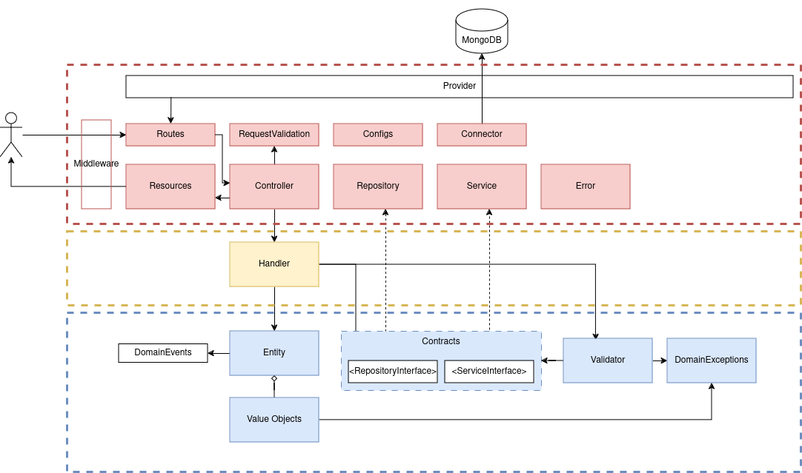

<h1 align="center">Daily Trends API</h1>

<p align="center">
  API to get news feed from the main news portals and management your own news feeds.
</p>

## Table of Contents

- [Table of Contents](#table-of-contents)
- [Installing](#installing)
  - [Environment](#environment)
  - [Docker](#docker)
- [Architecture](#architecture)
- [Development](#development)
- [Production](#production)
- [Testing](#testing)
- [Linting](#linting)

## Installing

First, make a copy from `.env.example` to `.env` and modify the environment values as you prefer.
```bash
cp .env.example .env
```
### Environment
- `NODE_ENV`: environments should be `production` or `development`.
- `TZ`: timezone
- `PORT`: internal port to run node
- `DB_HOST`: mongodb host
- `DB_PORT`: mongodb port
- `DB_USERNAME`: mongodb username
- `DB_PASSWORD`: mongondb password
- `DB_NAME`: mongodb database name

Note: the value of `NODE_ENV` defines that entrypoint run as dev (`npm run start:dev`) or production (`npm run start`)

### Docker
Get up containers
```bash
docker compose up
```
And the `npm` commands could execute on `api` service
```bash
docker compose exec api bash
```

## Architecture




## Development

```bash
npm run start:dev
```

## Production

```bash
npm run build
npm run start
```

## Testing

```bash
npm run test
```

## Linting

Run the linter

```bash
npm run lint
```

Fix lint issues automatically

```bash
npm run lint:fix
```
